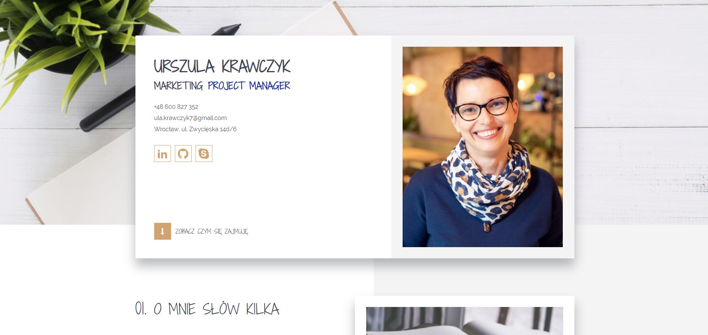
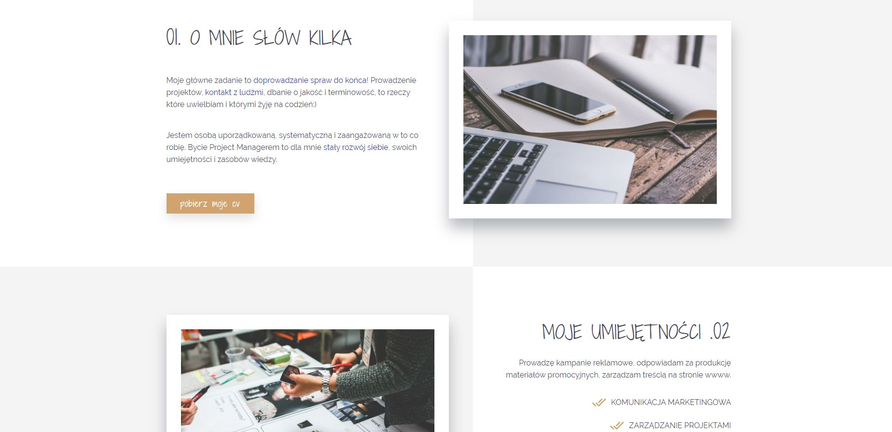

# MARKETING PROJECT MANAGER 
## MY FIRST WEBSITE RESUME

**If you want to try it out, click here: [Ula Krawczyk webpage](https://ulakrawczyk.github.io/marketing-manager/)**

### This is a simple landing page developed to practise what I've learned:
* semantic html5
* css3 with grid and flexbox layout
* sass
* adding svg icons and using sprite.svg
* project is build on a starter-kit by Maciej Korsan
* graphic design inpired by http://www.themeperch.net/ and modified in figma

### Page is fully responsive using:
* grid layout
* media queries and correct units
* responsive images with resolution switching
* desktop first technique

#### To run my project locally, you need:

`npm install -g gulp-cli`
`npm install`
`gulp`
